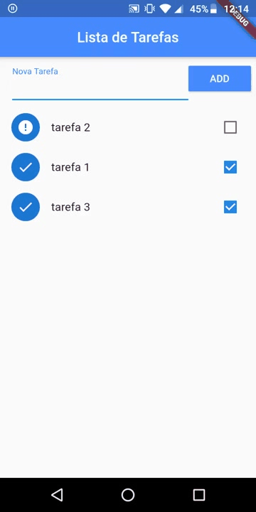

 <br>
<h1 align="center"> 📱 App Lista de Tarefas</h1>

<p align="center">Aplicativo que cria uma lista de tarefas, onde se pode marcar as tarefas comcluidas e remove-las permanentemente</p>


<p align="center">
  

  
</p>


<h4 align="center"> 
	🚧  APP 📱 Concluído 🚀 🚧
</h4>

<p align="center">
  <a href="#-sobre-o-projeto">Sobre</a> •
  <a href="#-tecnologias">Tecnologias</a> •
  <a href="#-funcionalidades">Funcionalidades</a> •
  <a href="#-como-rodar-o-projeto">Como Rodar</a> •
  <a href="#-autor">Autor</a> •
  <a href="#-licença">Licença</a> •
  
</p>


## 💻 Sobre o Projeto

  
  No APP lista de tarefas, voce pode criar, marcar e remover suas tarefas.
  Todos os dados são salvos no proprio aparelho, ou seja, mesmo reiniciando o aplicativo os dados vão permanecer até serem apagado permanentemente.
  As tarefas são reorganizadas em ordem de tarefas não concluidas primeiro ao atualizar a tela (arrastando a tela de cima para baixo).
  Ao apagar a tarefa apenas deslizando a tarefa para a direita, durante alguns segundos o usuário pode desfazer a ação.
  
---

## 🛠 Tecnologias

### [Flutter](https://flutter.dev/) e [Dart](https://dart.dev/) ultilizando as seguintes dependencias:
  
-  **[cupertino icons](https://pub.dev/packages/cupertino_icons)**
-  **[path_provider](https://pub.dev/packages/path_provider)**

> Para mais detalhes, veja o arquivo  [pubspec.yaml](./pubspec.yaml)

### **Utilitários**

-   Editor:  **[Visual Studio Code](https://code.visualstudio.com/)**  → Extensions: [Flutter](https://marketplace.visualstudio.com/items?itemName=Dart-Code.flutter)
---

## 📝 Funcionalidades

- [x] Adicionar suas tarefas na tela inicial
     - Salvando no próprio aparelho
- [x] Marcar a tarefa como comcluida
- [x] Colocar em ordem de tarefas não concluidas ao atualizar a pagina.
- [x] Remover tarefa permanentemente ao desliza-la para a direita
     - Ao remover, abrir uma opção de desfazer a ação por 3s
---

## 🎲 Como Rodar o Projeto

Antes de começar, você vai precisar ter instalado em sua máquina as seguintes ferramentas: [Git](https://git-scm.com), [Flutter](https://flutter.dev/) e seus devidos requisitos (flutter doctor) e um device (emulador ou dispositivo fisico). Além disto é bom ter um editor para trabalhar com o código como [VSCode](https://code.visualstudio.com/) ou [Android Studio](https://developer.android.com/studio)

```bash

# Clone este repositório
$ git clone https://github.com/robsongdev/APP-Lista-de-Tarefas.git

# Acesse a pasta do projeto no terminal/cmd
$ cd APP-Lista-de-Tarefas

# Vá para a pasta lib
$ cd lib

# Instale as dependências
$ flutter install

# Execute a aplicação
$ flutter run
```
---

## 👨‍💻 Autor


<sub> <b> Robson Gabriel</b> </sub>

Feito com ❤️ por Robson 👋🏽 Entre em contato!<br>
[](mailto:robsong369@gmail.com)


---
## 📝 Licença

<a href="./LICENSE">
  
</a>
